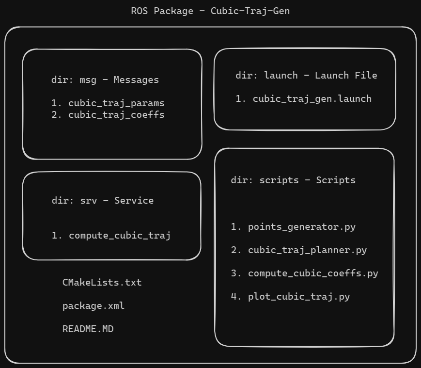
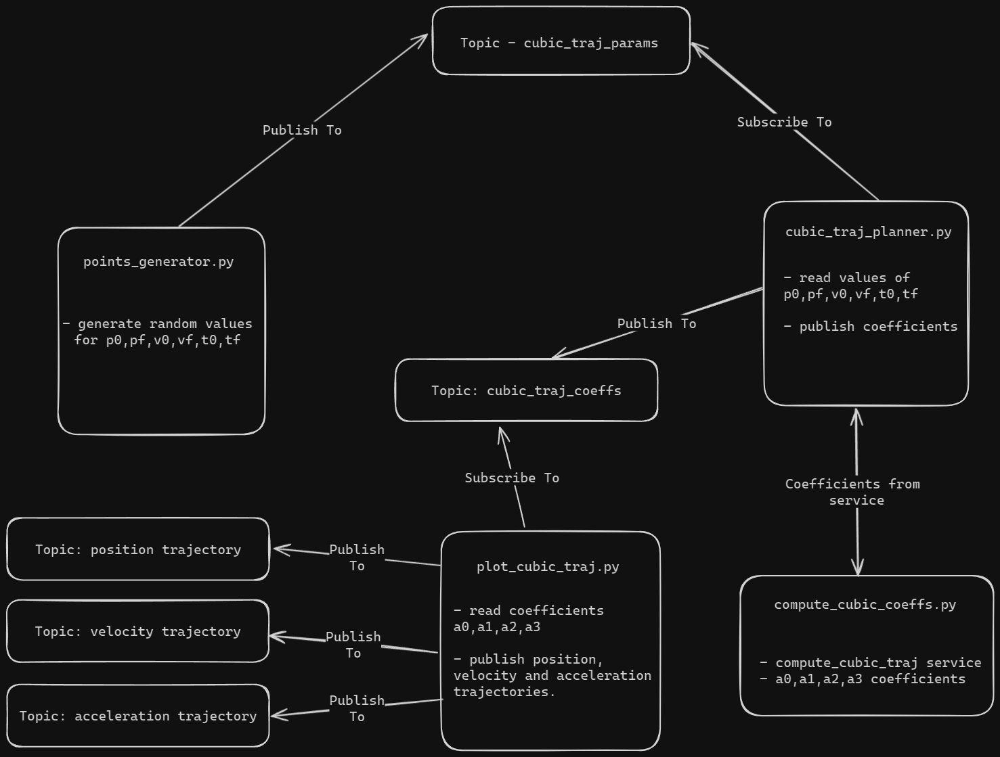

# cubic-traj-gen

- Code developed by Kaviraj Gosaye, QMUL
- Student ID: 220575371

- Package Name : ar_week8_test

### Description: 
>This ROS package will automatically generate point-to-point cubic trajectories connecting pairs of randomly generated points

## Commands to run package:

1. Unzip package ar_week8_test into the 'src' folder of the root directory of your catkin workspace.

2. Launch a terminal for ROS

3. Execute the following to setup environment variables: source /opt/ros/noetic/setup.bash

4. Build package (in root directory): catkin_make

5. Source the workspace: source devel/setup.bash

6. Execute the command to run the package: roslaunch ar_week8_test cubic_traj_gen.launch

>Running the step 6 will start the nodes and service and rqt_graph and rqt_plot GUI will automatically open.

- Select the topics trajPos, trajVel and trajAcc in rqt_plot to visualize the values. 
- Select Nodes/Topics(active) and click on refresh in rqt_graph to visualize the nodes and topics

## Tech and Versions:
1. Ubuntu 20.04.6 - focal
2. ROS Noetic
3. Python 3.8.10

## Package Structure:

## Communication Flow:

